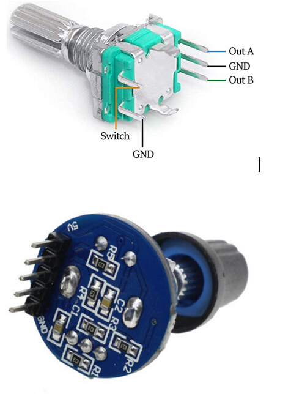
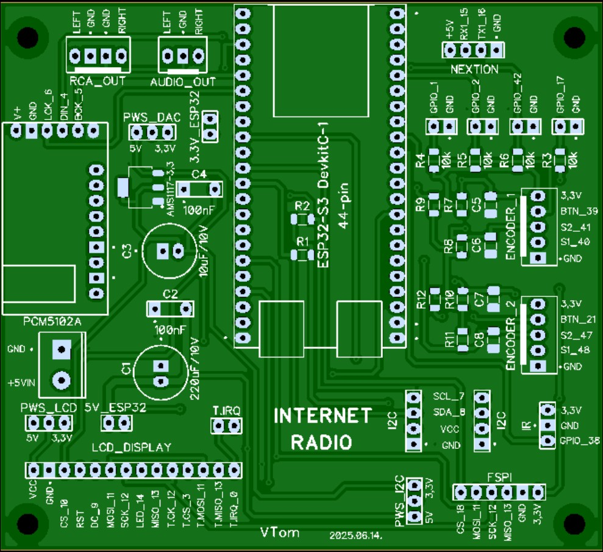
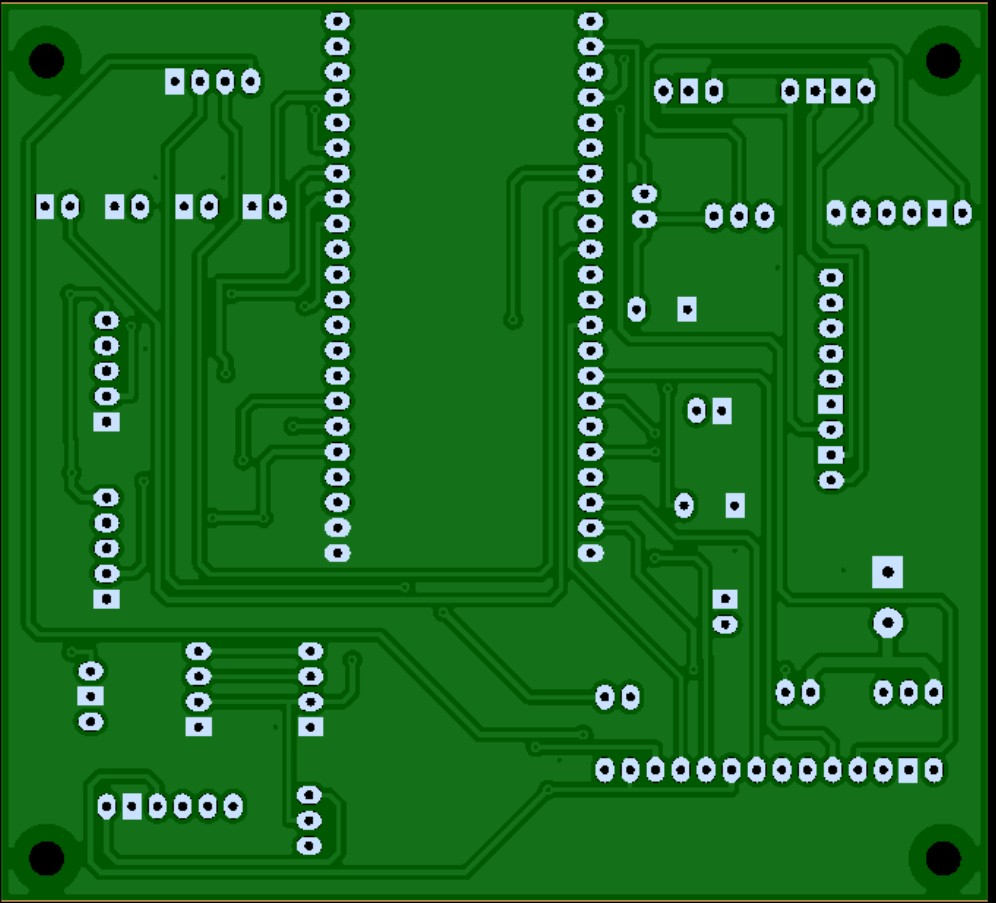
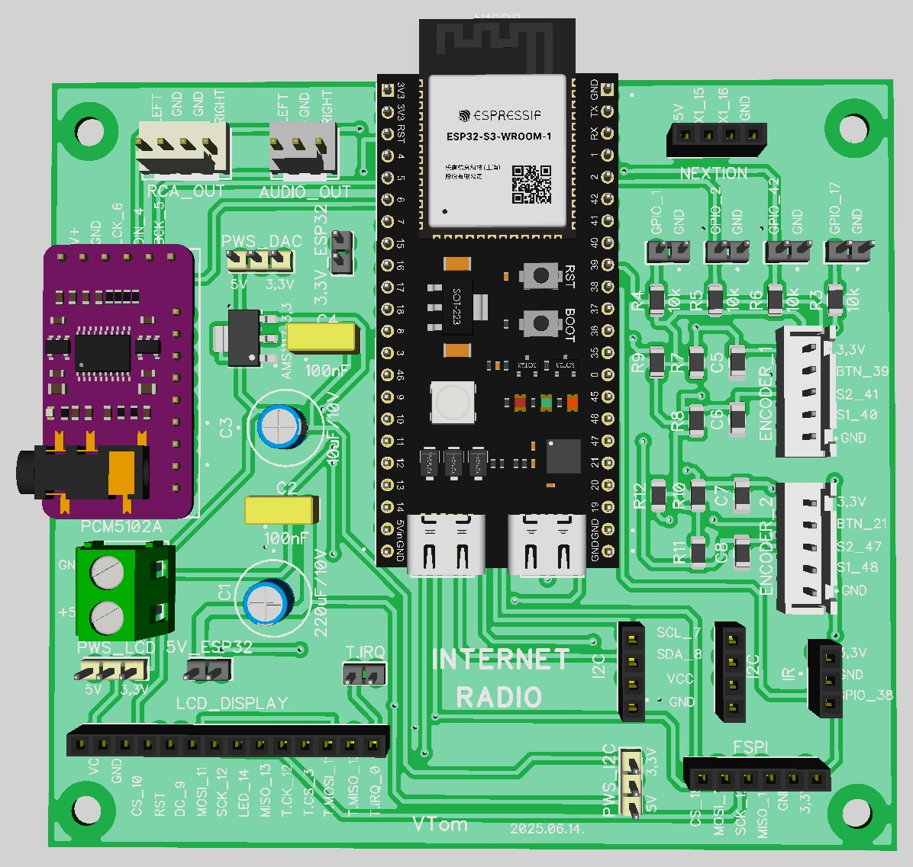

# Nyomtatott áramkör verzió: 2025.06.14  
- A PCB lap mérete 99x90mm
- az SMD alkatrészek mérete 1206
- GPIO_1, GPIO_2, GPIO_42, GPIO_17 nem használt PIN -ek kivezetései.
- Az R3 - R6 ellenállások a nem használt PIN -ek felhúzóellenállásai. Csak szükség esetén kell beforrasztani őket.
- Az ENCODER -hez tartozó ellenállások R7 - R12 10k értékűek, valamint a kondenzátorok C5 -C8 100nF értékűek és csak abban az esetben kell beforrasztani őket, ha nem ENCODER modult használsz. A modul már tartalmazza ezeket!

  
Az encoderek használata esetén a myoptions.h fájlban definiálni kell őket.  

        /* ENCODER 1 */
        #define ENC_BTNR 41  // S2
        #define ENC_BTNL 40  // S1
        #define ENC_BTNB 39  // KEY
        // #define ENC_INTERNALPULLUP		true

        /* ENCODER 2 */
        #define ENC2_BTNR 47  // S2
        #define ENC2_BTNL 48  // S1
        #define ENC2_BTNB 21  // KEY
        // #define ENC2_INTERNALPULLUP	true
- A PWS_DAC, PWS_LCD, PWS_I2C power select jumperek csak tesztelési céllal kerültek fel. Amennyiben a modul tartalmaz saját 3.3V -os stabilizátor IC -t, úgy lehet választani az 5V -os táplálást. Az LCD kijelző és a DAC esetében 3.3V -os táplálást kell választani.
- Az 5V_ESP32 jumper összezárása esetén az ESP modul a saját 3.3V -os stabilizátor IC -jét használja. A 3.3V_ESP32 jumperainak összezárása esetén az alaplapi stabilizátor IC táplálja az ESP modult. Ajánlott csak az 5V_ESP32 kapcsait összezárni.
- A MISO 13 vezetéket nem kell a kijelzőre bekötni, a kijelző nem küld információt az ESP irányába és folyamatos hangerő képernyő megjelenést okoz!
- A T.CK, T.CS, T-MISO, T.MOSI érintkezők az LCD modulon az érintőképernyő SPI vezetékei. Használat esetén mindegyiket be kell kötni. Amennyiben nem akarsz használni érintő kijelzőt és nem kötöd be ezeket, úgy a myoptions.h fájlban kommenteld ki a sor elejére helyezett // jellel az ide vonatkozó definíciókat. Ellenkező esetben mindig a hangerő képernyő jelenhet meg.

         /* Touch */
         // #define TS_MODEL TS_MODEL_XPT2046
         // #define TS_CS    3

- A T.IRQ jumpert nem kell összezárni.
- Az FSPI csatlakozóhoz lehet bekötni az SD kártya olvasót. Használata esetén a myoptions.h fájlban be kell kapcsolni a definíciókat.

        /* DS CARD */
        #define SDC_CS 18

- Az I2C csatlakozó alkalmas közvetlenül óramodul RTC DS3132 fogadására. Használata esetén a myoptions.h fájlban be kell kapcsolni a definíciókat.

        /* CLOCK MODUL RTC DS3132 */
        #define RTC_SCL			     7
        #define RTC_SDA			     8
        #define RTC_MODULE DS3231

  
  
  

