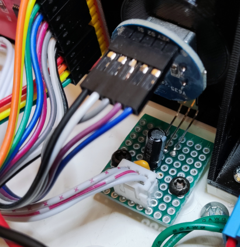

# Infravörös vevő power szűrő   
    
Ha vezetékkel van kivezetve az IR led a tápvezeték összeszed zajokat a környező vezetékek mágneses tere miatt, ezért stabilizálni kell a +5 Voltot a GND hez képest. Ez bevált gyakorlat a háztartási gépeknél is mint például TV vagy klíma.   
A zajt tanításnál lehet észrevenni, mert a távirányító megnyomása nélkül jelennek meg hexadecimális számok, vagy nem tudod ugyanazt a számot generálni egy gomb nyomkodásával.  
Az infravörös led tápjára párhuzamosan kell kötni egy 10μF elektrolit és egy 100nF kerámia kondenzátort, közel az infravevőhöz. 

A távirányító programozásával kapcsolatban itt olvashatsz. https://github.com/e2002/yoradio/blob/main/Controls.md#ir-receiver

