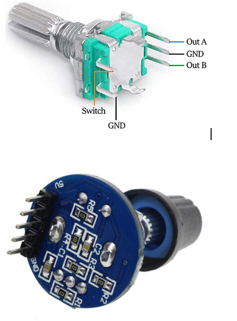

# Nyomtatott áramkör – verzió: 2025.12.21.

- **PCB mérete:** 98 × 100 mm
- **SMD alkatrészek mérete:** 1206
- Kapcsolási rajz PDF formátumban letölthető: [wiring_diagram_2025_dec_21.pdf](../../PCB/PCB_2025_12_21/wiring_diagram_2025_dec_21.pdf) 
- A `GPIO_1`, `GPIO_2`, `GPIO_42`, `GPIO_17` kivezetések nem használt PIN-ek, kivétel ha capacitive touch -ot használsz.  
  Ez esetben a `GPIO_17 - INT` és csak GT911 esetén a `GPIO_42 - RST` touch.
- **R1-R2** az I2C busz SCL és SCA felhúzóellenállásai. 2.2kΩ (Capacitive touch és RTC modul DS3132 használja.)
- Az **R3–R6** ellenállások a nem használt pinek felhúzóellenállásai. 
  Csak szükség esetén kell beforrasztani őket. 10kΩ
- Az **R13** ellenállás az ESP modul indulásánál segít, 3.3V -ra felhúzza a GPIO 0 PIN-t. 10kΩ
### Forgó jeleadó - rotary encoder
- Az ENCODER-hez tartozó alkatrészek:
  - **R7–R12** 10 kΩ
  - **C5–C8** 100 nF
  - Beültetésük csak akkor szükséges, ha **nem a képen látható kék ENCODER-modult** használsz (a modul ezeket tartalmazza már!)

<br><br>

Az encoderek használata esetén a `myoptions.h` fájlban definiálni kell őket:

```cpp
/* ENCODER 1 */
#define ENC_BTNR 41  // S2
#define ENC_BTNL 40  // S1
#define ENC_BTNB 39  // KEY
// #define ENC_INTERNALPULLUP true

/* ENCODER 2 */
#define ENC2_BTNR 47  // S2
#define ENC2_BTNL 48  // S1
#define ENC2_BTNB 21  // KEY
// #define ENC2_INTERNALPULLUP true
```
### Érintő képernyő SPI buszt használó XPT2046 chip esetén (resistive)  
- A T.CK, T.CS, T-MISO, T.MOSI érintkezők az LCD modulon az érintőképernyő SPI vezetékei. Használat esetén mindegyiket be kell kötni. Amennyiben nem akarsz használni érintő kijelzőt és nem kötöd be ezeket, úgy a myoptions.h fájlban kommenteld ki a sor elejére helyezett // jellel az ide vonatkozó definíciókat. Ellenkező esetben mindig a hangerő képernyő jelenhet meg.  

```cpp
/*----- Touch ISP -----*/
 #define TS_MODEL TS_MODEL_XPT2046
 #define TS_CS    3
```

### Érintő képernyő I2C buszt használó FT6X36 chip esetén (capacitive) 
  - A myoptions.h fájlban kell engedélyezni ezt a funkciót. A GPIO 17 az alaplapon nem az I2C csatlakozónál van, ezt külön kell bekötni. Felhúzóellenállás nem szükséges. 

  ```cpp
 /*----- Touch I2C -----*/
#define TS_MODEL TS_MODEL_FT6X36
#define TS_SCL      7
#define TS_SDA      8
#define TS_INT     17 
```

### SD kártya
- Az FSPI csatlakozóhoz lehet bekötni az SD kártya olvasót. Használata esetén a myoptions.h fájlban be kell kapcsolni a definíciókat.
```cpp
        /* DS CARD */
        #define SDC_CS 18
```
### RTC óramodul
- Az I2C csatlakozó alkalmas közvetlenül óramodul RTC DS3132 fogadására. Használata esetén a myoptions.h fájlban be kell kapcsolni a definíciókat.
```cpp
        /* CLOCK MODUL RTC DS3132 */
        #define RTC_SCL			     7
        #define RTC_SDA			     8
        #define RTC_MODULE DS3231
```
### Power-select jumperek       
A PWS_LCD, PWS_I2C power select jumperek csak tesztelési céllal kerültek fel. Amennyiben a modul tartalmaz saját 3.3V -os stabilizátor IC -t, úgy lehet választani az 5V -os táplálást.

- 5V_ESP32 zárása → az ESP a saját 3.3 V stabilizátorát használja

- 3.3V_ESP32 zárása → az ESP-t az alaplapi stabilizátor táplálja        
Ajánlás: csak az 5V_ESP32 ágat zárd!  

### A B0505S‑1WR3 egy DC-DC konverter (feszültségátalakító) modul.
Ez azt jelenti, hogy egy adott egyenáramú feszültséget másik egyenáramú feszültséggé alakítson át, miközben villamosan elválasztja (izolálja) a bemenetet és a kimenetet egymástól.
- Bemenet: kb. 5 V DC
- Kimenet: 5 V DC (stabil, izolált)
- Kimeneti áram: ~800 mA

Az ilyen modult akkor érdemes használni, ha például egy mikrokontroller vagy más érzékeny elektronika tápjáról szeretnél leválasztott, stabil 5 V-ot, vagy elektromos zaj/csatlakozási problémák miatt fontos az izoláció. Ebben az esetben a **POWER_OUT** kivezetésen keresztül lehetőség nyílik egy USB transmitter megtáplálására így annak hangjában nem lesz hallható az elektrónika által okozott nagyfrekvenciás zaj. 
- A B0505S‑1WR3 konvertert és a C1 és C2 kondenzátorokat csak akkor kell beforrasztani, ha ez a funkció használva lesz!

### Erősítő ki -be kapcsolása a képernyővédő és hangerő függvényében [olvasd el ezt!](../../docs/pwr_amp.md)

### Az ESP32-S3-DevKitC 1 N16R8 fejlesztőmodul lábkiosztása.      
<br><br>      

### Az ESP32-S3-DevKitC 1 N16R8 fejlesztőmodul lábkiosztása ebben a projektben.      
<br><br>

- Az ESP32-S3 kártyák esetében a HSPI busz által használt GPIO-k száma eltérhet (**SCK, MISO, MOSI**).  
  Általában **nincs elérhető VSPI busz**.

- **Ne használd a 35–37. GPIO-kat** 8 MB vagy nagyobb PSRAM-mal rendelkező alaplapokon.

- A **22–34, 45 és 46 GPIO-k** vagy foglaltak, vagy **nem használhatók**.

- A **GPIO 19 és 20** az USB porthoz tartozik,  
  a **GPIO 43 és 44** általában az USB- és a soros porthoz.  
  Egyes kártyák más GPIO-kat is használhatnak — **ellenőrizd kétszer**.

- A kijelző **VS RST tüskéjét** csatlakoztasd a panel **RST / EN / ST** tűjéhez  
  (érték: **-1**).

- A **GPIO 0 (BOOT)** és **GPIO 3 (JTAG)** rögzítőtüskék,  
  boot során **HIGH szinten kell lenniük** (nyomógombhoz csak körültekintéssel használhatók).

- Az SPI lábak ellenőrzéséhez itt találod a board-variánsokat:  
  https://github.com/espressif/arduino-esp32/tree/master/variants

- Fordítási konfigurációk:  
  https://github.com/sivar2311/ESP32-S3-PlatformIO-Flash-and-PSRAM-configurations

- Hardver beállítások:  
  https://github.com/e2002/yoradio#hardware-setup

- Flash-elési útmutató:  
  https://github.com/e2002/yoradio/wiki/How-to-flash


### Ez a PCB verzió legyártható a [jlcpcb.com](https://jlcpcb.com/) oldalon a [yoradio_gerber.zip](../../PCB/PCB_2025_12_21/yoradio_gerber.zip)   fájl feltöltésével.     

<br><br>
<br><br>
<br><br>

